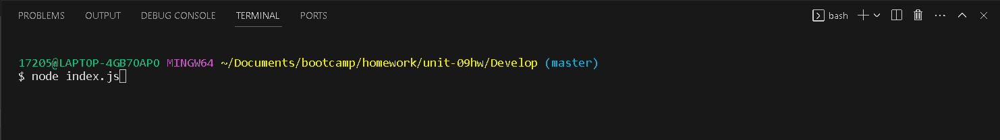
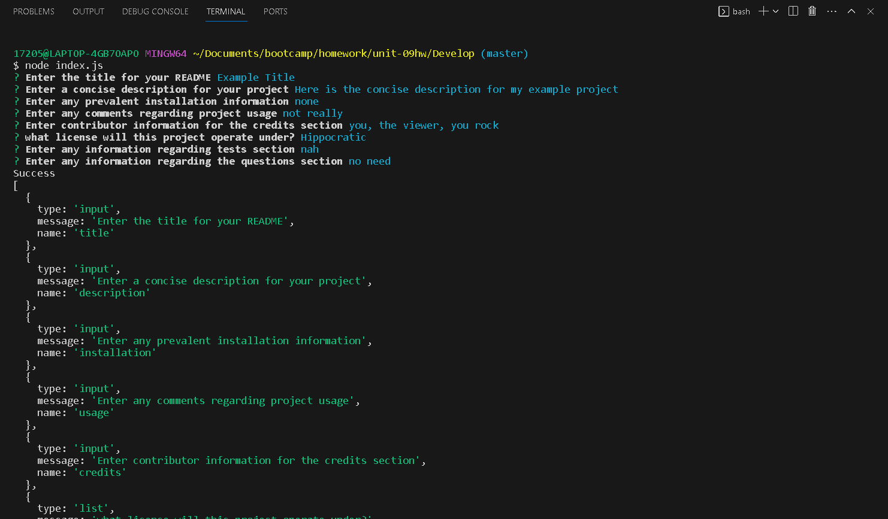
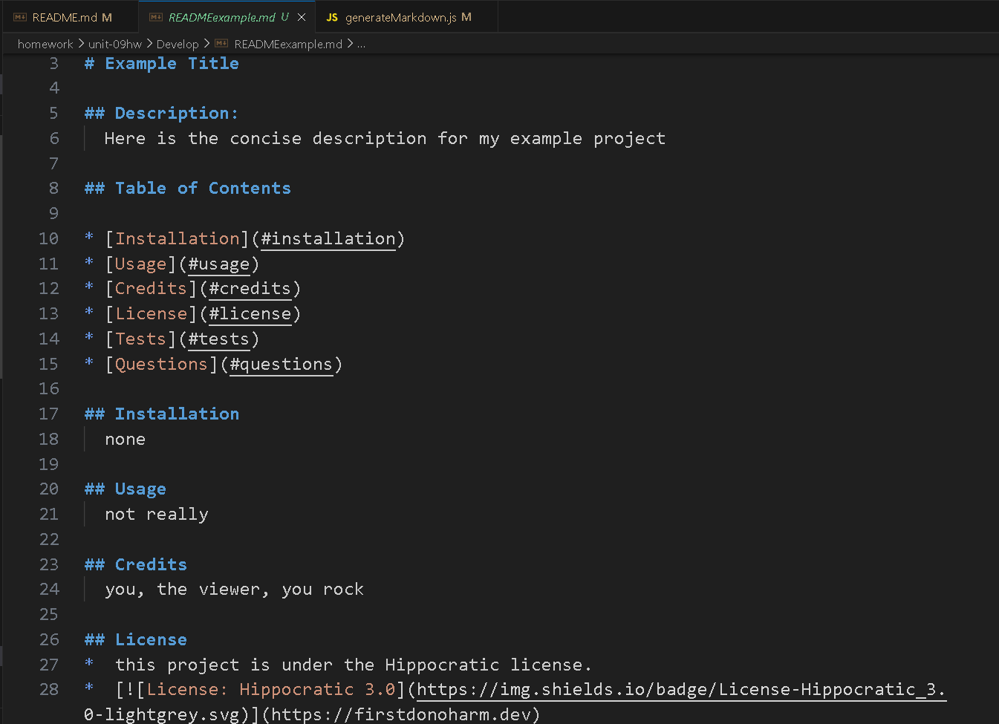

# README Generator

## Description
This application uses the command line to dynamically generate a professional README.md file. The user is prompted to enter the information for their README through a series of questions. The application is invoked by using the following command;

```bash
node index.js
```

### Screen Shots




### Links
[GitHub]https://github.com/Matt0Stark/README_Generator
[Video]


 You’ll need to submit a link to the video _and_ add it to the README of your project.


* Refer to the [Fullstack Blog Video Submission Guide](https://coding-boot-camp.github.io/full-stack/computer-literacy/video-submission-guide) for additional guidance on creating a video.


* A sample README generated using the application must be submitted.

* A walkthrough video that demonstrates the functionality of the README generator must be submitted, and a link to the video should be included in your README file.

* The walkthrough video must demonstrate how a user would invoke the application from the command line.

* The walkthrough video must demonstrate how a user would enter responses to all of the prompts in the application.

* The walkthrough video must demonstrate a generated README that matches the user input and has a functioning table of contents.

